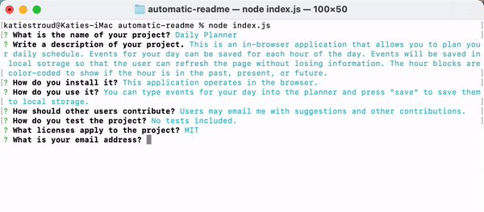

# Automatic README Generator

## Description

This application is a generator for a professional-quality README file. The user will respond to command line prompts. The application uses user input to populate a README file with a .md extension. The file will be named based on the user input.

[A video demonstrating the use of the application can be found here](https://youtu.be/fm2UNsIXXR8)

[This is an example of a README generated by the application](./assets/dailyplanner.md)

## Installation

This application is run in the command line. The user will need to download the code, then use

`npm i` 

to install all required packages. To run the application, run 

`node index.js`

The application will then initialize.

## Motivation

After practicing with JavaScript for several weeks, my goal was to begin using the language outside of the web browser. This application relies on Node and NPM Inquirer to run. Working on this application has helped me to learn about Node and Inquirer, as well as using command line utlities. 
